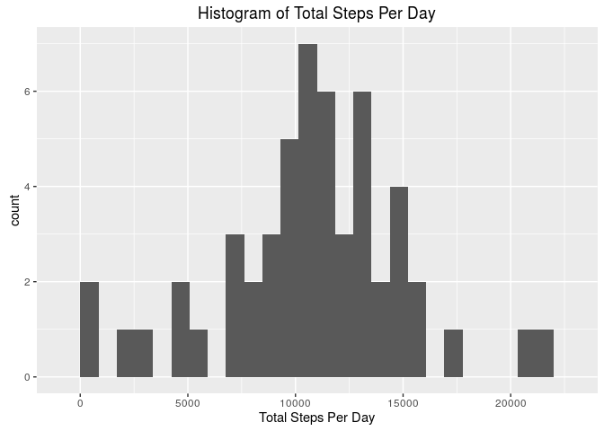
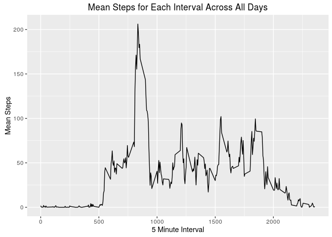
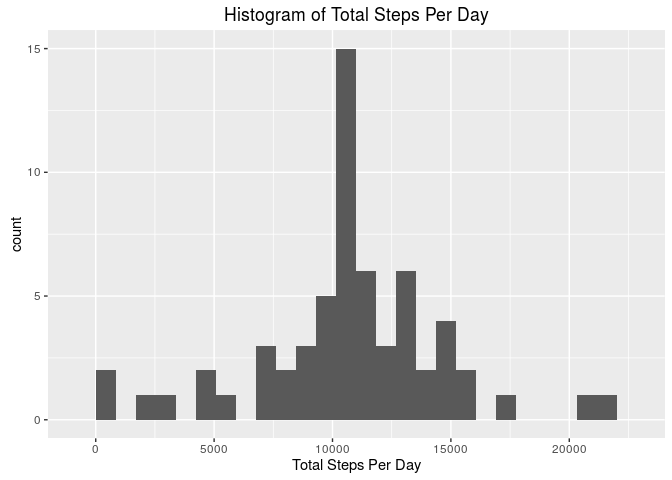
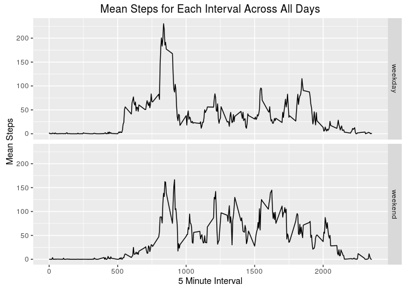

# Reproducible Research: Peer Assessment 1

## Load required packages


```r
if (!require(readr)) {install.packages("readr")}
```

```
## Loading required package: readr
```

```r
if (!require(dplyr)) {install.packages("dplyr")}
```

```
## Loading required package: dplyr
```

```
## 
## Attaching package: 'dplyr'
```

```
## The following objects are masked from 'package:stats':
## 
##     filter, lag
```

```
## The following objects are masked from 'package:base':
## 
##     intersect, setdiff, setequal, union
```

```r
if (!require(ggplot2)) {install.packages("ggplot2")}
```

```
## Loading required package: ggplot2
```

```r
sessionInfo()
```

```
## R version 3.2.3 (2015-12-10)
## Platform: x86_64-pc-linux-gnu (64-bit)
## Running under: Ubuntu 14.04.3 LTS
## 
## locale:
##  [1] LC_CTYPE=en_US.UTF-8       LC_NUMERIC=C              
##  [3] LC_TIME=en_US.UTF-8        LC_COLLATE=en_US.UTF-8    
##  [5] LC_MONETARY=en_US.UTF-8    LC_MESSAGES=en_US.UTF-8   
##  [7] LC_PAPER=en_US.UTF-8       LC_NAME=C                 
##  [9] LC_ADDRESS=C               LC_TELEPHONE=C            
## [11] LC_MEASUREMENT=en_US.UTF-8 LC_IDENTIFICATION=C       
## 
## attached base packages:
## [1] stats     graphics  grDevices utils     datasets  methods   base     
## 
## other attached packages:
## [1] ggplot2_2.0.0 dplyr_0.4.3   readr_0.2.2  
## 
## loaded via a namespace (and not attached):
##  [1] Rcpp_0.12.2      digest_0.6.9     assertthat_0.1   plyr_1.8.3      
##  [5] grid_3.2.3       R6_2.1.1         gtable_0.1.2     DBI_0.3.1       
##  [9] magrittr_1.5     scales_0.3.0     evaluate_0.8     stringi_1.0-1   
## [13] rmarkdown_0.9.2  tools_3.2.3      stringr_1.0.0    munsell_0.4.2   
## [17] yaml_2.1.13      parallel_3.2.3   colorspace_1.2-6 htmltools_0.3   
## [21] knitr_1.12
```

## Loading and preprocessing the data

### Unzip the activity dataset


```r
unzip("activity.zip")
```

### Read data into R


```r
activity <- read_csv("activity.csv")
```

## What is mean total number of steps taken per day?

### Make a histogram of the total number of steps taken each day


```r
total_steps <- activity %>% group_by(date) %>% summarize(ts = sum(steps))

ts_hist <- ggplot(total_steps, aes(ts)) + 
             geom_histogram(bins = 25) +
             xlab("Total Steps Per Day") + 
             ggtitle("Histogram of Total Steps Per Day")
ts_hist
```

```
## Warning: Removed 8 rows containing non-finite values (stat_bin).
```

\


### Calculate mean and median total steps per day


```r
mean(total_steps$ts, na.rm = TRUE)
```

```
## [1] 10766.19
```

```r
median(total_steps$ts, na.rm = TRUE)
```

```
## [1] 10765
```


## What is the average daily activity pattern?


```r
steps_by_interval <- activity %>% group_by(interval) %>% 
                             summarize(ms = mean(steps, na.rm = TRUE))

activity_pattern <- ggplot(steps_by_interval, aes(interval, ms)) + 
                      geom_line() +
                      xlab("5 Minute Interval") + ylab("Mean Steps") +
                      ggtitle("Mean Steps for Each Interval Across All Days")
activity_pattern
```

\

The 5-minute interval which, on average across all days of the dataset, contains
the maximum number of steps is:


```r
steps_by_interval$interval[which.max(steps_by_interval$ms)]
```

```
## [1] 835
```


## Imputing missing values

The total number of rows with missing values in this dataset is:


```r
sum(is.na(activity))
```

```
## [1] 2304
```


### Fill in missing values

A new dataset `activity_filled` is created by filling in NA values with the mean 
for that 5-minute interval across all days.


```r
activity_filled <- activity
for (loc in which(is.na(activity_filled))) {
        activity_filled$steps[loc] <- steps_by_interval %>% 
                                      filter(interval == activity_filled$interval[loc]) %>% 
                                      select(ms) %>% unlist()
}
```


### Histogram of total steps per day with filled values


```r
total_steps_f <- activity_filled %>% group_by(date) %>% summarize(ts = sum(steps))

ts_hist_f <- ggplot(total_steps_f, aes(ts)) + 
               geom_histogram(bins = 25) +
               xlab("Total Steps Per Day") + 
               ggtitle("Histogram of Total Steps Per Day")
ts_hist_f
```

\


### Mean and median total steps per day with filled values


```r
mean(total_steps_f$ts)
```

```
## [1] 10766.19
```

```r
median(total_steps_f$ts)
```

```
## [1] 10766.19
```

Interestingly, the mean for the dataset with the filled in missing values is the
same as the mean without the filled values, and the median of the data with the
filled values is identical to the mean, which is only slightly greater than the
median without the filled values.


## Are there differences in activity patterns between weekdays and weekends?

### Create weekday factor


```r
activity_filled <- activity_filled %>% mutate(day = weekdays(date)) %>% 
                   mutate(day = ifelse(((day == "Saturday") | (day == "Sunday")),
                                       "weekend", "weekday")) %>% 
                   mutate(day = factor(day))
```


### Plot weekdays vs. weekends


```r
steps_by_interval_f <- activity_filled %>% group_by(interval, day) %>% 
                               summarize(ms = mean(steps))

activity_pattern_f <- ggplot(steps_by_interval_f, aes(interval, ms)) + 
                        geom_line() + facet_grid(day ~ .) +
                        xlab("5 Minute Interval") + ylab("Mean Steps") +
                        ggtitle("Mean Steps for Each Interval Across All Days")
activity_pattern_f
```

\

